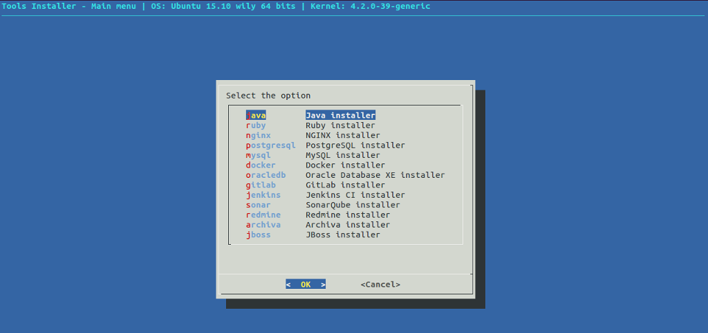
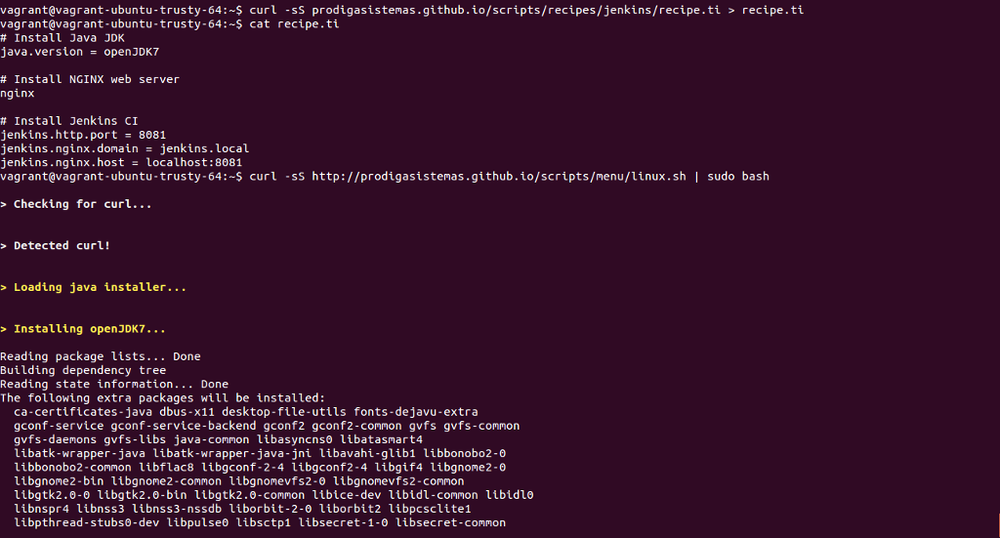

# Tools Installer

## Instale e configure, rapidamente, ferramentas nas plataformas Linux

## Ferramentas
* Linguagens de programação
  * [Java](https://www.oracle.com/java/index.html)
  * [Ruby](https://www.ruby-lang.org)
* Servidor web
  * [Nginx](https://www.nginx.com)
* Servidores de aplicação
  * [JBoss](https://www.jboss.org) e [Wildfly](http://wildfly.org)
  * [Puma Service](http://puma.io)
* Servidores de banco de dados
  * [MySQL](https://www.mysql.com)
  * [PostgreSQL](https://www.postgresql.org)
  * [Oracle Database XE](https://hub.docker.com/r/wnameless/oracle-xe-11g/) via Docker
* Gerenciador de repositórios Java
  * [Archiva](http://archiva.apache.org)
* Gestão de projetos
  * [Redmine](http://www.redmine.org)
* Gerenciador de repositórios de código
  * [GitLab](https://about.gitlab.com)
* Servidor de automação
  * [Jenkins](https://jenkins.io)
* Qualidade de código
  * [SonarQube](http://www.sonarqube.org)
* Gestão de Containers
  * [Docker](https://www.docker.com)

## É preciso ter instalado o pacote _curl_

### No Debian ou Ubuntu
    sudo apt-get -y install curl

### No CentOS
    sudo yum -y install curl

## Provisionamento manual

O comando abaixo inicia o menu principal para instalação das ferramentas

    curl -sS https://prodigasistemas.github.io/ti/scripts/menu/linux.sh | sudo bash

## Provisionamento automático

As receitas de instalação estão disponíveis [no link](https://github.com/prodigasistemas/prodigasistemas.github.io/tree/master/scripts/recipes). Basta você criar um arquivo recipe.ti e executar o mesmo comando acima para as ferramentas serem instaladas e configuradas automaticamente.

### Exemplo de instalação do Jenkins Automation Server

    curl -sS https://prodigasistemas.github.io/ti/scripts/recipes/jenkins/recipe.ti > recipe.ti

    curl -sS https://prodigasistemas.github.io/ti/scripts/menu/linux.sh | sudo bash

[Pródiga Sistemas](http://www.prodigasistemas.com.br) © 2016
